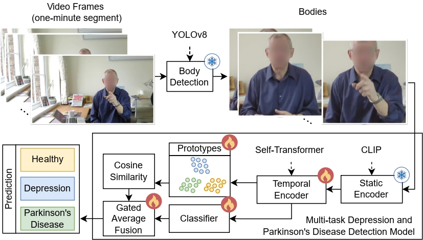

# DEPART: Multi-Task Interpretable Depression and Parkinson's Disease Detection from In-the-Wild Video Data

**Authors**
Elena Ryumina, Alexandr Axyonov, Mikhail Dolgushin, Dmitry Ryumin\*, and Alexey Karpov

## Abstract

Automated video-based detection of cognitive disorders can enable scalable non-invasive health monitoring. However, existing methods focus on a single disease and provide limited interpretability, whereas real-world videos often contain co-occurring conditions. We propose a novel unified multi-task method to detect depression and Parkinson's disease (PD) from in-the-wild video data called DEPART (**DE**pression & **PA**rkinson's **R**ecognition **T**echnique). It performs body region extraction, Contrastive Language-Image Pre-training (CLIP)-based visual encoding, Transformer-based temporal modeling, and prototype-aware classification with gated fusion. Gradient-based attention maps are used to visualize task-specific regions that drive predictions. Experiments on the In-the-Wild Speech Medical (WSM) corpus demonstrate competitive performance: the multi-task model achieves Recall of 82.39% for depression and 78.20% for PD, compared with 87.76% and 78.20% for the best single-task models. The multi-task setting initially increases false positives for healthy persons in the PD subset, mainly due to annotation-modality mismatches, static visual content misinterpreted as motor impairments, and occasional body detection failures. After cleaning the test data, Recall for healthy individuals becomes comparable across models; the multi-task model improves Recall for both depression (from 82.39% to 87.50%) and PD (from 78.20% to 86.14%), suggesting better robustness for real-life clinical applications.

## Overview

This repository implements the DEPART training and evaluation pipeline:
- Body region extraction with YOLO.
- Visual feature encoding with CLIP/ViT.
- Temporal modeling with Transformer or Mamba.
- Prototype-aware classification for interpretable multi-task learning.
- Hyperparameter search modes: `none`, `greedy`, `exhaustive`.

Current active pipeline entrypoint: `main.py`.

## DEPART Pipeline



## Environment

Install dependencies:

```bash
pip install -r requirements.txt
```

Main dependencies include:
- PyTorch 2.6 (CUDA 12.4 build in `requirements.txt`)
- Transformers
- Ultralytics (YOLO)
- scikit-learn, pandas, numpy

## Data Format

Each dataset split is configured in `config.toml` under `[datasets.*]`.

Expected CSV columns:
- `video_id`
- `diagnosis`
- `segment_file`

Expected segment path layout:

```text
<video_dir>/<video_id>/segments/<segment_file>
```

## Configuration

Main configuration file: `config.toml`.

Key sections:
- `[general]` - global settings, Telegram notifications.
- `[datasets.*]` - WSM dataset locations.
- `[dataloader]` - loader behavior and `prepare_only`.
- `[train.general]` - training setup, search mode, early stopping, prototype losses.
- `[train.model]` - model type and architecture hyperparameters.
- `[train.optimizer]` / `[train.scheduler]` - optimization and LR scheduling.
- `[embeddings]` - feature extraction and aggregation settings.
- `[cache]` - feature cache behavior.

Supported `model_name` values:
- `transformer`
- `mamba`
- `prototypes`

## Run

Start training/search:

```bash
python main.py
```

Behavior is controlled by `search_type` in `config.toml`:
- `none` - single training run.
- `greedy` - greedy hyperparameter search (`search_params.toml`).
- `exhaustive` - exhaustive hyperparameter search (`search_params.toml`).

## Outputs

Each run creates a timestamped directory:

```text
results/results_<model_name>_<YYYY-MM-DD_HH-MM-SS>/
```

Typical artifacts:
- `session_log.txt` - run log.
- `config_copy.toml` - config snapshot.
- `overrides.txt` - hyperparameter search log.
- `checkpoints/` - best model checkpoints.
- `checkpoints/.../eval_protocol/` - per-epoch TSV protocols with `y_true`/`y_pred`.

Additional exported prediction files:
- `pkl_logits/*.pkl` (train/dev/test exports from best checkpoint).

## Data
We used the publicly available corpus In-the-Wild Speech Medical - [WSM](https://www.dropbox.com/scl/fo/jp3kc9pgjyuazmcfhjyup/ABSxzJIpfeybFHEL3p8sjWM?rlkey=4gedeh8kcpkiuoa90rexodcfy&e=1&dl=0). We also provide the segmented and [cleaned WSM data](https://gofile.me/6UX1J/fq1NM6ShJ) for general access.
## Notes

- The current implementation uses body modality in the active training pipeline.
- If Telegram notifications are enabled, set `TELEGRAM_BOT_TOKEN` and `TELEGRAM_CHAT_ID` in environment variables (or `.env`).
